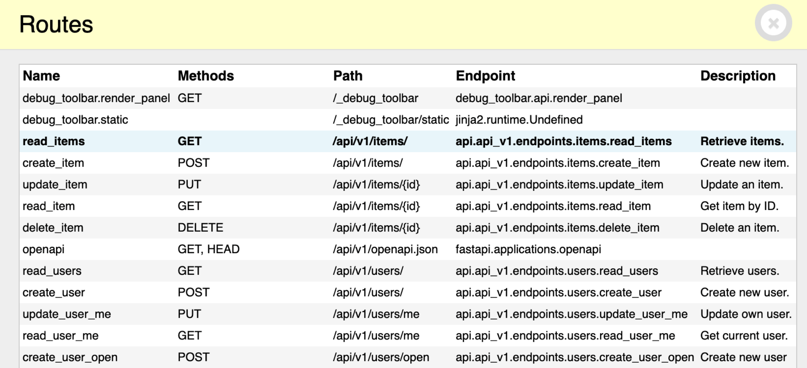
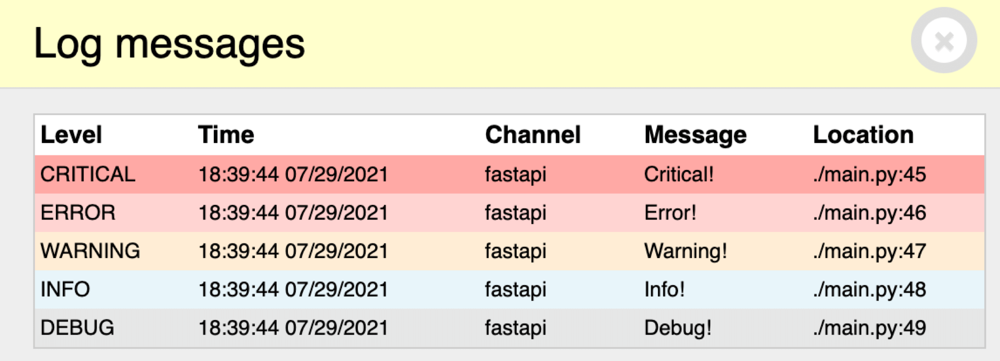

Here's a list of default panels available:

## Versions


## Timer


## Settings


Add your pydantic's [BaseSettings](https://pydantic-docs.helpmanual.io/usage/settings/) classes to this panel:

```py hl_lines="11"
{!src/panels/settings.py!}
```

## Request


## Headers


## Pydantic


## Routes



## Logging



## Profiling


Profiling reports provided by [Pyinstrument](https://github.com/joerick/pyinstrument), you can configure the [profiler parameters](https://pyinstrument.readthedocs.io/en/latest/reference.html#pyinstrument.Profiler) by adding `profiler_options` settings:

```py hl_lines="5"
{!src/panels/profiling.py!}
```

